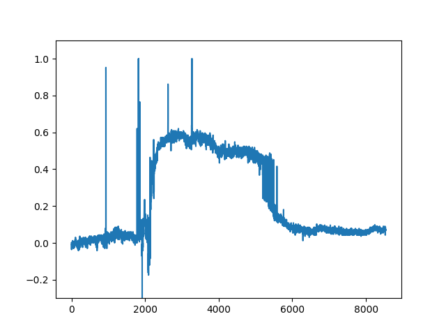
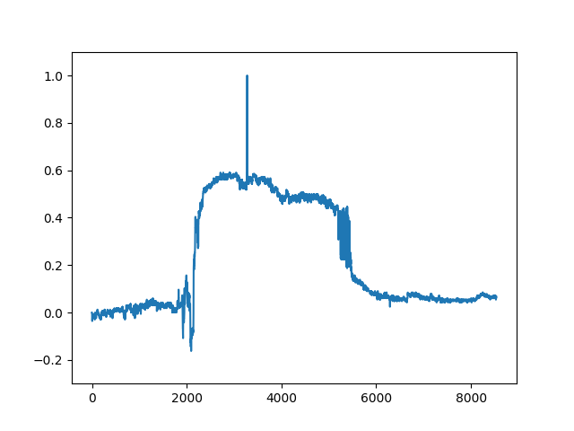
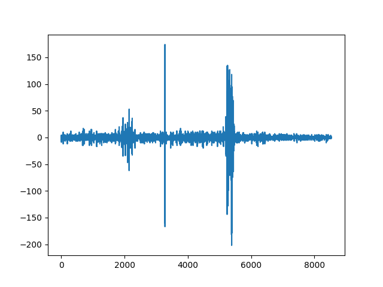
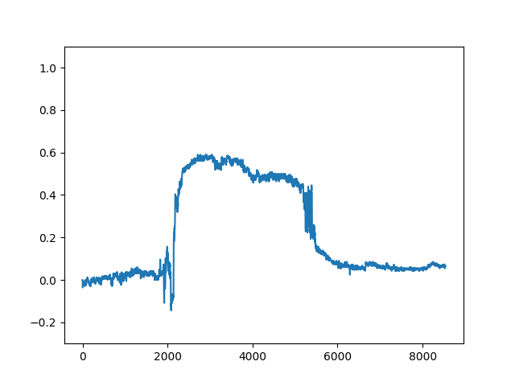

# Canyu's FCN Smoothed Results

Yongqing Liang

10/04/2018

## 1. Original Result



## 2. Time Series Smooth



$Mask\_New_i = (1-decay) * Mask\_New_{i-1} + decay * Mask_i$

$Mask\_New_i = threshold(Mask\_New_i, thres, 255)$

where $decay = 0.2, thres=200$

## 3. Laplacian Detect Peak



$kernel\_size=5$

$kernel =  [-1/6, 8/3, -5, 8/3, -1/6]$

Apply on the time series smoothed result.

## 4. Median Filter



$kernel\_size = 9$

```
if (laplacian val at t> 30) then
	Apply median filter on t-1
	Apply median filter on t
	Apply median filter on t+1
```


